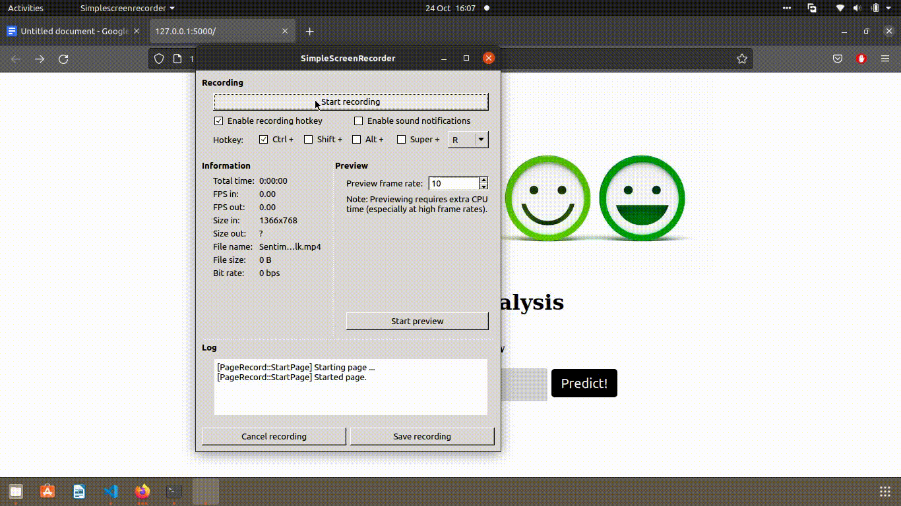

<h2>1.Introduction</h2>
Understanding the reason of sales inclination and declination is a challenging task. But what if we can understand how a users feel about
any particular item ?. This is a simple project that can be used to determine the sentiment of a customer and what they feel about the product with the help of Comments they have provided. Customer sentiment is categorized into ordinal categories i.e. Positive , Neutral and Negative. 
As the project is text based NLTK toolkit is used as it helps us perform statistical language processing. 

<h4>Vectorization technique </h4>
Two vectorization techniques are used they are 
Countvectorizer
TF-IDF
<h4> Algorithm used </h4>
Logistic regression
Naive bayes 

<h2>Objective</h2>
Learning by doing research required for the project 
Learning and implementation of Data handling techniques
Understanding different algorithms use cases in sentiment analysis 

<h2>Data Set</h2>

Data set used in the project is <b>Amazon fine food reviews </b>. It consist data from more then 10 years. 

The main focus of the project is to evaluate the review of the user. So reviews include product information and reviewer information, plain text and user ratings. 

<h4>Attributes </h4>
- Product Id 
- User Id 
- Profile Name 
- Helpfulness Numerator 
- Helpfulness DeNumerator
- Score 
- Time 
- Summary 
- Text 

<h2>Project Flow </h2>
1)Data collection 
2)Data preprocessing 
3)Data visualization 
4)Model Training 
5)Model Evaluation and selection 
6)Deployment 

<h2>Deployment</h2>

The project is deployed using flask application.

<h4>Process for deployment</h4>
1)Dumping  the model as a pickle file. 
2)Dumping  the labelized values as pickle file
3)Making a Preprocessor file so that user input can be preprocessed to feed in the model 
4)Feeding the preprocessed data into the model to get the output.
5)Associating output with labels and images. 

<h2>Project Installation</h2>
1)Clone this repository in your local machine and unzip it.
2)Navigate to the project where app.py exists using the CD command. 
3)If required then create a new virtual environment and activate it.
4)Install the required packages using requirements.txt provided.
5)pip -r requirements.txt 
6)Now to run the project execute flask run command 
7)Click on the http://127.0.0.1:5000/ link on the command prompt or copy it on the browser 

<h2> Project Sample </h2>

  
